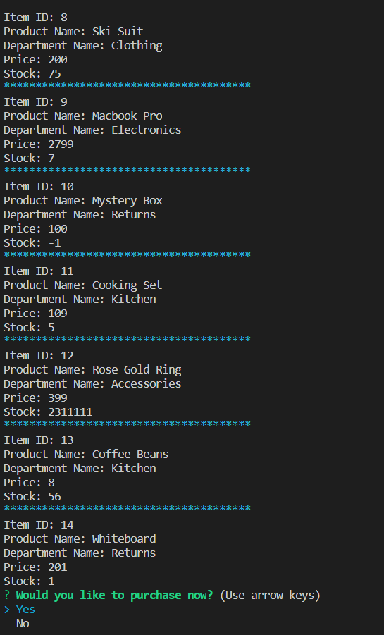
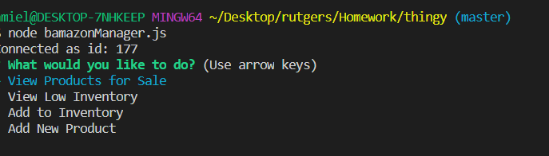

# thingy 

Bamazon

"Thingy" is an Amazon-like storefront built with MySQL and Node.js. The app will take in orders from customers and deplete stock from the store's inventory. 

### Prerequisites

You will need to install the following to make your own Thingy:

```

   * [npm install mysql]

   * [npm install inquirer]
   
```

### How To Use Thingy (Customer Interface)

1. Open your editor.
2. Open `bamazonCustomer.js` file. 

    **Flow 1**: Running bamazonCustomer.js will result in all the items in the inventory displaying in the terminal and a prompt asking if the user would like to purchase now.
    
        node bamazonCustomer.js

    

    **Flow 2**: Clicking "Yes" will prompt the user for the ID of the product and quantity they want to purchase and another prompt asking if they would like to place another order. Clicking "Yes" will display list of items. Clicking "No" will log "Thank you for using Bamazon! See you soon!" and exit the app. 

    

    **No**

    

    **Flow 3**: Ordering an item that is greater than the available inventory will result in the app not letting the order to go through.

    **No Inventory**
    
    

    ### Table Results

    **Start**
    Pay attention to Item 14.

    

     **End**
    Pay attention to Item 14.

    

### How To Use Thingy (Manager Interface)

1. Open your editor.
2. Open `bamazonManager.js` file. 

    **Flow 1**: Running bamazonManager.js will result in prompting the user what they would like to do.
    
        node bamazonManager.js

    

    **Flow 2**: Clicking "View Products For Sale" will result in all items being shown. See Image under Flow 1 in Customer Interface above for an example.

    **Flow 3**: Clicking "Add to Inventory" will prompt the user for the ID number of the product they would like to add to and the quantity to be added. 
    
    

    **Flow 4**: Clicking "Add New Product" will prompt the user for the product name, the department the new item should go into, the price of the new item, and the quantity.
    
    


    ### Table Result

    **Start**

    

     **End**
    Item 15 added and Item 14 has more in stock now.

    


## Created By

* **Amiel Nicdao** [GitHub](https://github.com/amielnicdao/thingy)

**For mySQL and Node.js homework**

## Technologies

* Javascript
* Node.js
* Dependencies:
    * mysql
    * inquirer
*MySQL

## Acknowledgments

* Instructor
* TAs
* Classmates

